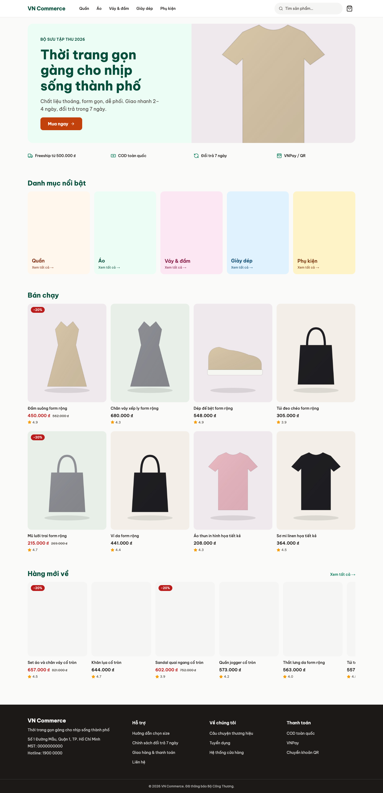
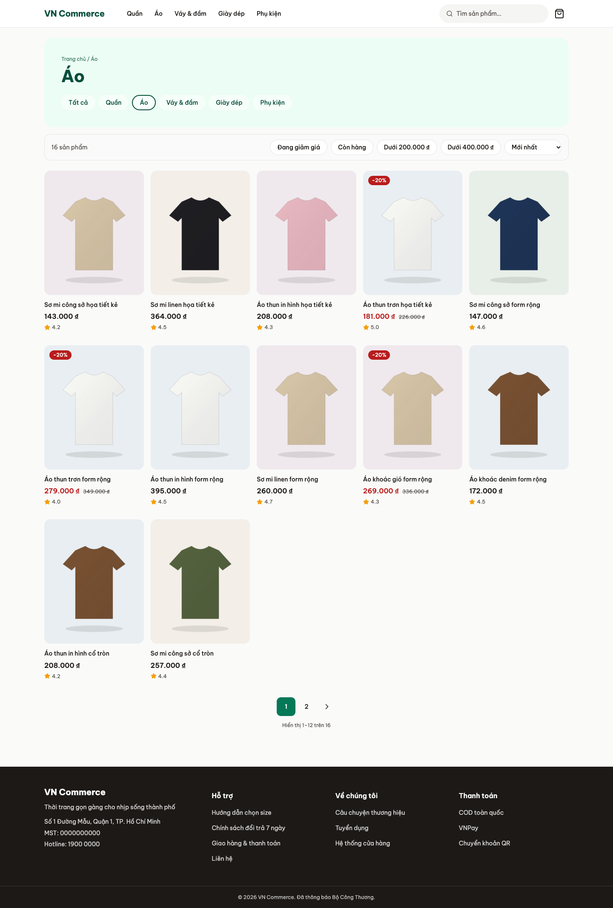
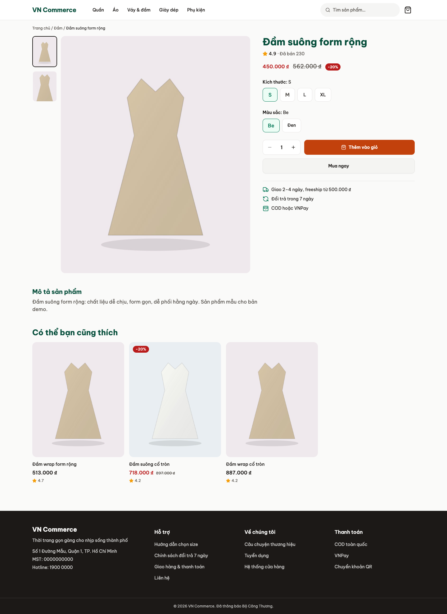
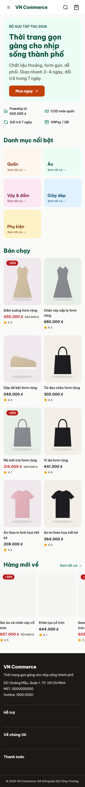
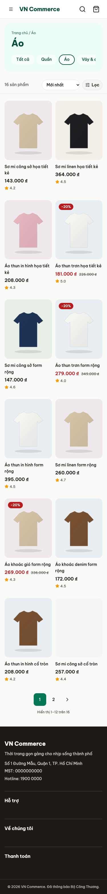
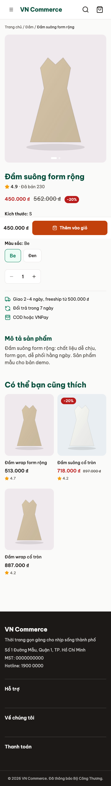
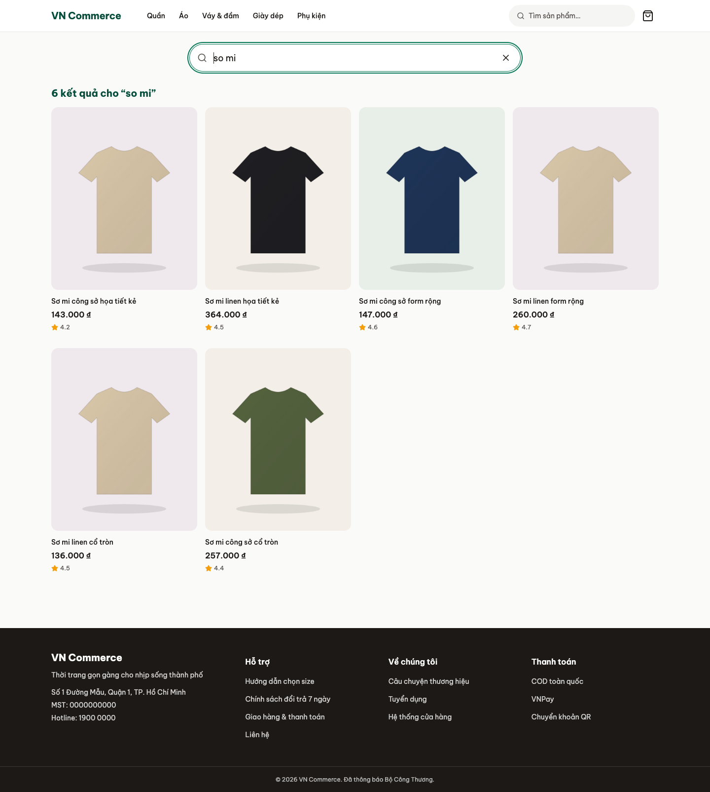

# VN Commerce Kit

Vietnamese e-commerce store for an SME: **Medusa v2** backend with the stock admin, a **Next.js** storefront, and the
reusable VN pieces (VNPay, VN addresses, accent-insensitive search). The demo walks browse → search → cart → checkout
(COD or VNPay sandbox) → confirmation.

- **Demo:** [X] (storefront) · [X] (admin, stock Medusa dashboard)
- **Demo account:** none needed. Checkout is guest-only; any synthetic name, a phone like `0900000123` and a province/ward work.
  VNPay runs against the sandbox: use the sandbox test card from VNPay's docs, never a real card.
- The public mock URL (if shown instead of the demo above) carries a "Dữ liệu demo" banner and is `noindex`.

| Home | Category listing | Product |
| --- | --- | --- |
|  |  |  |

| Home (375 px) | Listing (375 px) | Product (375 px) |
| --- | --- | --- |
|  |  |  |

Search: 

## Run it locally
```
make up                    # postgres, redis, meilisearch, minio, mailpit, simulators
make backend-setup         # migrate, VN region, publishable key, dev admin
make seed                  # mini catalogue (COUNT=900 for the full one)
pnpm dev                   # backend :9000, storefront :8000
```
The storefront reads fixtures by default (`NEXT_PUBLIC_API_MODE=mock`, no backend needed); set `real` plus the keys in
`apps/storefront/README.md` to use Medusa. Deploy: `infra/README.md`. Tests: `pnpm test`, journeys: `make e2e`.

Regenerate the screenshots above: `pnpm --filter @vck/storefront build && pnpm --filter @vck/storefront start -p 8000`, then `scripts/readme-shots.sh`.

## Repository
| Path | What |
| --- | --- |
| `apps/backend` | Medusa server + worker, custom modules, workflows, VNPay provider |
| `apps/storefront` | Next.js App Router, Tailwind v4, shadcn/ui, Motion |
| `packages/ui-kit` | Design tokens and motion primitives |
| `tools/` | Seed engine and assets, VNPay and GHN simulators |
| `contracts/` | OpenAPI, fixtures, VNPay golden vectors |
| `design-system/` | MASTER tokens and per-page specs |

## Video outline (about 2 minutes)
1. Home and a category on a phone: speed, Vietnamese typography, filters in the bottom drawer.
2. Search `ao so mi` without accents; it finds `áo sơ mi`.
3. Product page: size and colour, add to cart, cart sheet, then guest checkout with province and ward.
4. Pay by VNPay sandbox; the order turns paid only after the server-side IPN, not the browser return.
5. Stock admin: the order, the stock level that dropped, and the confirmation email in Mailpit.

## Working on it
Read `CLAUDE.md` first; the plan and tracker are `docs/plan.md`, the rules `docs/rules.md`.
