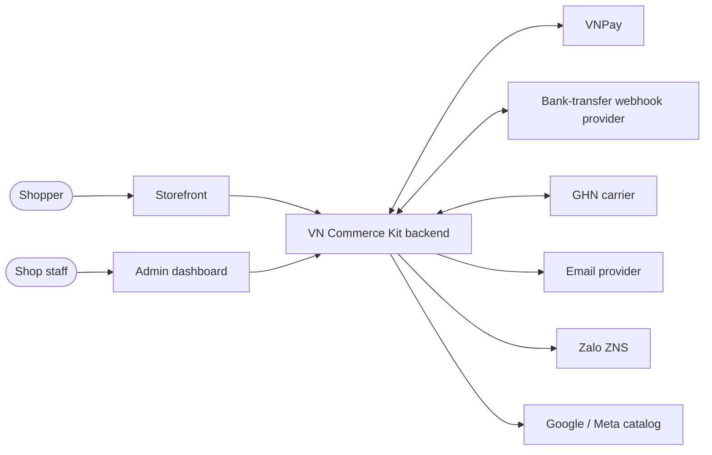
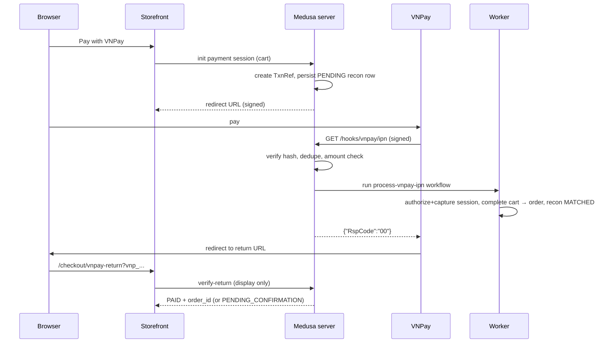

# Software Architecture Document — VN Commerce Kit
Version 1.0 · 2026-09-29 · Owner: Tech lead

## 1. Scope
Covers the Medusa backend (server + worker), admin extensions, Next.js storefront, reusable plugins, tooling and
deployment. Provider integrations (VNPay, VietQR/bank webhook, GHN) are specified in `03-integration-spec.md`.

## 2. Architecture drivers
### 2.1 Functional requirements
| ID | Requirement | Epic |
| --- | --- | --- |
| FR-01 | Browse categories and products with variants, images, stock status | E1 |
| FR-02 | Accent-insensitive search with facets (size, colour, price, category) and sorting | E1 |
| FR-03 | Cart and guest/registered checkout with address, shipping option, payment | E2 |
| FR-04 | Pay by COD, VNPay, VietQR bank transfer | E2, E6 |
| FR-05 | Reconcile online payments; detect and resolve mismatches | E2, E5 |
| FR-06 | Refund VNPay payments fully or partially | E2 |
| FR-07 | Customer registration, login, email verification, password reset | E3 |
| FR-08 | Customer dashboard: profile, addresses, orders, tracking, wishlist, deletion | E3, E4 |
| FR-09 | 2-tier VN addresses with legacy (3-tier) resolution | E4 |
| FR-10 | Live shipping quotes, waybill creation, tracking via carrier webhooks | E4 |
| FR-11 | Admin manages products, categories, inventory, orders, customers (Medusa core) | E1, E5 |
| FR-12 | Admin KPI dashboard, bulk CSV import/export, packing slips, audit log | E5 |
| FR-13 | Transactional notifications by email and Zalo ZNS | E6 |
| FR-14 | Verified-purchase reviews with moderation | E6 |
| FR-15 | SEO metadata, structured data, sitemap, Google/Meta product feeds | E7 |
| FR-16 | Synthetic data at realistic and stress scale | E1, E8 |
| FR-17 | Guest order lookup (code + phone), tracking, ZNS opt-in, OTP-verified self-cancel per shop policy | E4 |

### 2.2 Quality attribute scenarios (NFR)
| ID | Attribute | Scenario | Measure |
| --- | --- | --- | --- |
| NFR-01 | Performance | 50 RPS mixed browse on demo VPS | PDP/PLP p95 TTFB < 300 ms cached, < 800 ms uncached |
| NFR-02 | Performance | Search on realistic seed | `/store/search` p95 < 150 ms, stress seed p95 < 400 ms |
| NFR-03 | Correctness | 500 concurrent checkouts on 10 units | 0 oversold units; 490 clear "out of stock" results |
| NFR-04 | Correctness | IPN delivered 1–5 times, any order, or never | Exactly one order per paid cart; missing IPN resolved by query within 15 min |
| NFR-05 | Availability | Worker killed mid-workflow | Workflow resumes or compensates; no half-created order after restart |
| NFR-06 | Resilience | Carrier API 3 s latency / 30% errors | Checkout still completes with FLAT_RATE fallback; p95 checkout < 1.5 s |
| NFR-07 | Security | OWASP ASVS L1 on store/admin APIs | 0 high findings (ZAP baseline); webhooks reject bad signatures 100% |
| NFR-08 | Privacy | Customer requests deletion | PII anonymised within 30 days; orders kept with anonymised refs |
| NFR-09 | Frontend | Mobile Lighthouse on home/PLP/PDP | ≥ 90 performance, ≥ 95 accessibility; CLS < 0.1 |
| NFR-10 | Operability | Any production alert | Runbook exists; MTTR target < 30 min for P1 in demo |
| NFR-11 | Maintainability | New client project | Plugin install + configure < 15 min each; storefront rebrand via tokens < 1 day |
| NFR-12 | Recoverability | DB loss | RPO ≤ 5 min (WAL archiving), RTO ≤ 1 h, restore drill each release |

### 2.3 Constraints
Solo owner reviewing all PRs; Medusa v2.21+ APIs; VND only, region VN; hosting budget for demo ≤ ~25 USD/month;
no real merchant credentials in repo; Vietnamese UI, English code and docs.

## 3. C4 L1 — Context

Shoppers and staff use two UIs over one backend; every external system is behind a plugin.

## 4. C4 L2 — Containers
| Container | Technology | Responsibility | Owns data | Interfaces |
| --- | --- | --- | --- | --- |
| storefront | Next.js App Router | Shopping UI, SEO, ISR | none (cookies only) | Store API, custom store routes |
| backend-server | Medusa v2 (server mode) | Store/Admin/Hook APIs, admin SPA | Postgres (all modules) | HTTP |
| backend-worker | Medusa v2 (worker mode) | Subscribers, jobs, async workflow steps | same DB | Redis event bus, workflow engine |
| postgres | PostgreSQL 16 | System of record | — | — |
| redis | Redis 7 | Event bus, workflow engine, cache, locking | ephemeral | — |
| meilisearch | Meilisearch | Search index (derived) | derived | Search provider |
| object storage | S3/R2 + CDN | Product images, feeds, slips | files | File module |
| sims | Node (tools/sims) | VNPay/GHN simulators for dev/CI/chaos | none | HTTP |
Rule: only the backend touches Postgres; the storefront never reads the DB; plugins persist only through their own modules.

## 5. C4 L3 — Components (backend)
| Component | Responsibility | Pattern |
| --- | --- | --- |
| Custom modules (`vn_address`, `review`, `wishlist`, `payment_recon`, `shipment_tracking`, `audit_log`, `import_job`, `processed_event`) | Own custom tables | Module + Repository |
| Module links | Relate custom data to core (order↔shipment, product↔review, customer↔wishlist) | Link table |
| Workflows | Checkout completion, IPN processing, reconciliation, refund, fulfillment, import, deletion | Saga with compensation |
| Payment providers (VNPay, VietQR, COD) | Session lifecycle, webhook → action mapping | Strategy / Adapter |
| Fulfillment provider (GHN) | Options, price calc, create/cancel | Strategy / Adapter |
| Search provider | Index definitions, query compile | Adapter |
| Subscribers | Event → workflow; revalidation pings; notifications | Observer |
| Jobs | Reconciliation sweep (5 min), feed build (hourly), deletion anonymiser (daily) | Scheduler + batch |
| Problem mapper | Errors → RFC 9457 | Single mapper |

## 6. Runtime views
### 6.1 VNPay payment (happy path)

### 6.2 Failure flows (owners)
| Flow | Behaviour | Owner |
| --- | --- | --- |
| Duplicate IPN | Dedupe on (provider, vnp_TransactionNo); reply 02 "already confirmed" | `process-vnpay-ipn` |
| IPN never arrives | Reconciliation job queries `querydr` for PENDING > 15 min; completes or fails | `reconcile-payments` job |
| IPN after cart expired/cancelled | Recon MISMATCH `LATE_PAYMENT_AFTER_CANCEL`; admin refunds from console | ADM console + refund workflow |
| Amount mismatch | Reply 04; recon MISMATCH `AMOUNT_DIFF`; no order | IPN workflow |
| Worker crash mid-completion | Workflow engine (Redis) retries step; compensation releases reservation | Medusa workflow engine |
| GHN webhook stale/out of order | Apply only forward transitions per state machine (docs/03 §6.3) | shipment_tracking |
| Carrier timeout during quote | Quote returns TIMEOUT; FLAT_RATE remains | quote route |
| Price change | Subscriber → signed POST to storefront `/api/revalidate` with tags | revalidation subscriber |

## 7. Cross-cutting concerns
### 7.1 Security & privacy
Admin auth via Medusa users; store auth via customer tokens; webhooks verified (HMAC or shared token) before parsing
the body further; rate limits: store 60 req/min/IP on auth routes, hooks 300 req/min/provider; secrets from env;
PII masked in logs; deletion workflow anonymises PII after 30 days (NFR-08). Guest order lookup (ADR-014): generic 404 +
constant-time response, 10 req/10 min/IP, 5 failures/order → 15 min lock, captcha after 3 failures, header-only token,
server-side masking, OTP for cancel only.

### 7.2 Idempotency
| Boundary | Key | Behaviour |
| --- | --- | --- |
| VNPay IPN | `vnp_TxnRef` + `vnp_TransactionNo` (unique) | Second delivery → RspCode 02, no side effects |
| Bank-transfer webhook | provider transaction `id` (unique) | Ignored if seen |
| GHN webhook | (`OrderCode`, `Status`, `Time`) hash | Ignored if seen; stale status ignored |
| Custom store/admin writes | `Idempotency-Key` header, 24 h TTL in Redis | Same response replayed |
| Event subscribers | event `id` in `processed_event` | Skip if processed |
| Refund | recon id + amount + attempt | VNPay `vnp_RequestId` reused on retry |

### 7.3 Concurrency & consistency
Inventory reservation inside the cart-completion workflow (Medusa locking); reconciliation rows use optimistic
`version`; jobs take a Redis lock (`lock:job:<name>`, TTL = 2× interval) so only one worker runs them.

### 7.4 Resilience settings
| Setting | Default | Where |
| --- | --- | --- |
| Outbound HTTP timeout | 5 s (carriers 3 s) | plugin options |
| Retries (idempotent only) | 3, exp backoff 200 ms × 2ⁿ + jitter | plugin options |
| Reconciliation sweep | every 5 min, PENDING older than 15 min, batch 100 | job config |
| Cart payment session expiry | 15 min (matches `vnp_ExpireDate`) | VNPay options |
| Circuit breaker (carrier quote) | open after 5 failures / 30 s, half-open after 60 s | GHN plugin |

### 7.5 Error model
RFC 9457 problem+json; problem types under `https://vck.dev/problems/<slug>` (catalogue in docs/04 §3). Provider
acknowledgements keep provider formats (VNPay JSON RspCode) and are never problem+json.

### 7.6 Observability
Log fields: `ts, level, msg, service, trace_id, span_id, route, actor_type, order_id, cart_id, txn_ref, duration_ms`.
Metrics (Prometheus via OTel): `vck_http_requests_total`, `vck_http_request_duration_seconds`, `vck_ipn_received_total{result}`,
`vck_recon_mismatch_total{reason}`, `vck_checkout_completed_total{payment}`, `vck_carrier_request_duration_seconds{carrier}`,
`vck_search_duration_seconds`, `vck_job_runs_total{job,result}`. Traces: span per request, workflow step, outbound call.
Errors to Sentry with PII scrubbing. Alerts in docs/runbooks.

### 7.7 Feature flags
`FF_S<n>_<NAME>` env flags read at boot; storefront reads public mirrors. Flags removed one release after enable.

## 8. Deployment
| Service | Port | Notes |
| --- | --- | --- |
| storefront | 8000 | Node server (standalone output) behind Caddy; CDN for static |
| backend-server | 9000 | `/app` admin; health `/health/ready` |
| backend-worker | — | same image, `MEDUSA_WORKER_MODE=worker` |
| postgres / redis / meilisearch | 5432 / 6379 / 7700 | private network only |
| sims (dev/CI/staging) | 9100 vnpay, 9101 ghn | never in production |
Environments: local (compose), staging (VPS, sandbox providers, stress seed), production-demo (VPS, sandbox providers,
realistic seed, nightly reset). AWS reference (ECS Fargate, RDS, ElastiCache, S3+CloudFront) documented in ADR-009.

## 9. Technology stack
| Area | Choice |
| --- | --- |
| Commerce | Medusa v2 (≥ 2.21, pinned in VCK-005) |
| Storefront | Next.js App Router, React, Tailwind, TanStack Query (client leaves only) |
| UI design & motion | UI UX Pro Max skill (design-time), Be Vietnam Pro, Lucide, Motion (`motion/react`), View Transitions, GSAP (home only) |
| Language | TypeScript strict, Node 20 LTS+ |
| Data | PostgreSQL 16, Redis 7, Meilisearch (version pinned in VCK-106) |
| Monorepo | pnpm workspaces + Turborepo + Changesets |
| Tests | Jest (Medusa), Vitest, Playwright, k6, Testcontainers, openapi validators |
| Observability | OpenTelemetry, Prometheus/Grafana, Sentry |
| CI/CD | GitHub Actions, Docker, Caddy on VPS |

## 10. Architecture decisions
ADR-001 monorepo · ADR-002 Medusa as engine · ADR-003 storefront rendering · ADR-004 plugins as packages ·
ADR-005 contract scope · ADR-006 search · ADR-007 payment truth & reconciliation · ADR-008 money ·
ADR-009 hosting · ADR-010 documentation lifecycle · ADR-011 AI workflow & token budget · ADR-012 address model · ADR-013 design system & motion · ADR-014 guest order access.

## 11. Risks
See `09-risk-register.md`.

## 12. Extension catalogue (future client projects)
Research-backed options that fit the same architecture. Each is a module/plugin toggled per client; estimate in points.
| Capability | Fit | Approach | Est. |
| --- | --- | --- | --- |
| MoMo / ZaloPay wallets | Very common VN ask | Payment providers reusing VNPay recon module | 8 each |
| E-invoice (MISA/Viettel/VNPT) | Required for companies | Subscriber on order.completed → provider adapter | 8 |
| GHTK / Viettel Post | Carrier choice | Fulfillment providers on the GHN template | 5 each |
| Guest cancel for online-paid orders | Fewer support calls | Option B of ADR-014: refund adapters, VCK-408 | 5 |
| Flash sale | Promotions + urgency | Price list + countdown + reservation guard (reuse VCK-207 tests) | 8 |
| Loyalty points / referral | Retention | Custom module + promotion integration | 13 |
| Abandoned cart recovery | Revenue | Job on stale carts → email/ZNS | 5 |
| B2B pricing / quotes | Wholesale clients | Customer groups + price lists (core) + quote module | 8–13 |
| Pre-order / back-in-stock | Fashion, electronics | Inventory flags + notification subscriber | 5 |
| Multi-warehouse | Growing shops | Core stock locations + carrier pickup per location | 5 |
| Marketplace sync (Shopee, TikTok Shop) | Omnichannel | Inventory sync jobs; partner API access is the blocker | 13+ |
| Multi-vendor marketplace | Platforms | Evaluate Mercur (Medusa-based) vs custom seller module | spike |
| Headless CMS pages/blog | Content-led SEO | Payload/Strapi/Sanity + ISR | 8 |
| AI search & descriptions | Differentiator | Vector search provider + generation job | 8–13 |
| Multi-language / currency | Export shops | Regions + i18n routing | 8 |
