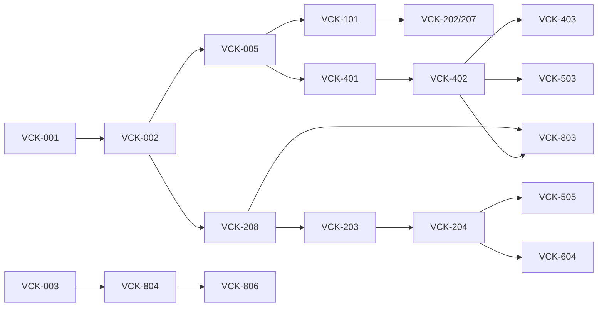

# Delivery Plan
Version 1.0 · 2026-09-29 · Owner: Tech lead

## 1. Delivery model and capacity
Solo tech lead (Khai) + parallel Claude Code lane sessions. Sprints are 2 weeks. Review is the bottleneck.
| Item | Value |
| --- | --- |
| Lanes | PLAT, BE, ADM, PKG, WEB (docs/02, root CLAUDE.md §5) |
| Lane throughput | ≈ 13 pts/sprint per active lane |
| Review capacity (Khai, part-time) | ≈ 30 pts/sprint |
| Buffer | 15% |
| Commitment | ≤ 30 pts/sprint; Sprint 7 kept lighter on new scope (ops) |
| PR size | ≤ 400 changed lines excl. generated |
| Total | 58 stories · 245 pts (R1.0: 55 stories · 232 pts in 8 sprints; R1.1: +8 pts in Sprint 8; VCK-408 backlog 5 pts) |

## 2. Feature slices
| Slice | Backend / provider | Frontend | Contract | Flag | Release |
| --- | --- | --- | --- | --- | --- |
| S1 Catalogue | VCK-101, VCK-103 | VCK-104, VCK-105 | Medusa Store API products/categories + fixtures | `FF_S1_CATALOG` | R0.1 |
| S2 Search | VCK-106 | VCK-107 | `/store/search` | `FF_S2_SEARCH` | R0.1 |
| S3 Checkout (COD) | VCK-202, VCK-207 | VCK-201 | Medusa cart/checkout API | `FF_S3_CHECKOUT` | R0.1 |
| S4 Accounts | VCK-301 | VCK-302 | Medusa auth/customer API | `FF_S4_ACCOUNTS` | R0.1 |
| S5 VNPay | VCK-203, VCK-204 | VCK-206 | verify-return, `/hooks/vnpay/ipn` | `FF_S5_VNPAY` | R0.2 |
| S6 Address & shipping | VCK-401, VCK-402, VCK-403 | VCK-404, VCK-405 | vn-address, quote, tracking, `/hooks/ghn` | `FF_S6_SHIPPING` | R0.3 |
| S8 VietQR | VCK-604 | VCK-607 | vietqr instruction, `/hooks/vietqr` | `FF_S8_VIETQR` | R0.4 |
| S9 Engagement | VCK-303, VCK-304, VCK-603 | VCK-606 | wishlist, reviews, deletion-request | `FF_S9_ENGAGEMENT` | R0.5 |
| S10 Guest access | VCK-406 (option B later: VCK-408) | VCK-407 | `/store/order-lookup*` | `FF_S10_GUEST_ACCESS` | R1.1 |
Outside slices: platform (E0, incl. VCK-009 design system), VCK-705 motion audit, ADM stories (self-contained API + admin UI, flags `FF_ADM_<NAME>`), ops (E8), SEO/perf, VCK-205 (uses core admin refund UI), VCK-208, VCK-601, VCK-602, VCK-704.

## 3. Sprint plan
`A ∥ B` = parallel, `A → B` = sequence. Wave 1 starts after the sprint's contract PRs merge (day 1).
| Sprint | Goal | Wave 1 ∥ | Wave 2 | Pts | Release |
| --- | --- | --- | --- | --- | --- |
| 0 | Repo, infra, CI, contracts, design system, skeletons | VCK-001 → (VCK-002 ∥ VCK-003 ∥ VCK-004 ∥ VCK-008 ∥ VCK-009) | VCK-005 → VCK-007 ∥ VCK-006 | 30 | — |
| 1 | Catalogue with realistic data and search engine | VCK-101 ∥ VCK-102 ∥ VCK-104 ∥ VCK-105 ∥ VCK-106 | VCK-103 | 29 | — |
| 2 | Shop end-to-end with COD and accounts | VCK-107 ∥ VCK-201 ∥ VCK-302 ∥ VCK-202 ∥ VCK-301 | VCK-207 | 28 | R0.1 |
| 3 | VNPay with IPN and reconciliation | VCK-208 ∥ VCK-206 ∥ VCK-401 ∥ VCK-304 | VCK-203 → VCK-204 | 28 | R0.2 |
| 4 | Shipping, refunds, admin insight | VCK-404 ∥ VCK-405 ∥ VCK-402 ∥ VCK-501 ∥ VCK-205 | VCK-403 ∥ VCK-505 | 30 | R0.3 |
| 5 | Operations tooling, email, VietQR, reviews API | VCK-502 ∥ VCK-504 ∥ VCK-601 ∥ VCK-603 ∥ VCK-607 ∥ VCK-604 | VCK-503 | 29 | R0.4 |
| 6 | Engagement UI, ZNS, SEO, performance, motion polish | VCK-303 ∥ VCK-606 ∥ VCK-602 ∥ VCK-701 ∥ VCK-702 | VCK-703 ∥ VCK-705 | 29 | R0.5 |
| 7 | Prove it: stress, load, chaos, production, demo | VCK-801 ∥ VCK-804 ∥ VCK-805 ∥ VCK-704 | VCK-802 ∥ VCK-803 → VCK-806 | 29 | R1.0 |
| 8 | Guest self-service (lookup + COD self-cancel) + buffer | VCK-406 ∥ VCK-407 (WEB on fixtures after the contract PR) | hardening, R1.0 feedback | 8 | R1.1 |
Backlog (pull when the owner wants online-paid self-cancel): VCK-408 (option B, 5 pts) — options + refund adapters only (ADR-014).

## 4. Dependency graph and critical path

Critical path: VCK-001 → 002 → 208 → 203 → 204 → 505 (payment truth). Protect it: first review slot each day,
no scope added mid-sprint, VNPay sandbox access requested in Sprint 0 (R-02).

## 5. Definition of Ready
Testable numbered AC; lane, points, slice, deps set; contract changes identified and scheduled for day 1; doc sections
referenced; migration names reserved; test approach known; no open design question (else schedule brainstorming);
`docs/progress/PROGRESS.md` shows dependencies merged.

## 6. Definition of Done
- **Story**: root CLAUDE.md §7 checklist; plan file kept in `docs/plans/`; PROGRESS entry added; UI stories pass docs/13 §6.
- **Slice**: both sides merged behind flag; integration checkpoint (`make up && make e2e`, flag on, mocks off) green with
  output pasted; 30–60 s demo clip; RELEASE draft section written.
- **Release**: `make release VERSION=x.y.z`; RELEASE file completed (docs/12 §4); CHANGELOG updated; tag pushed; flags of
  the previous release removed; risk register reviewed; PROGRESS "Now" block reset.

## 7. Branching, versioning, flags
Trunk-based; `feat|fix|chore/VCK-<id>-<slug>` ≤ 3 days; `contract/<slice>-<slug>` merged first; squash merge with
`type(scope): summary (VCK-<id>)`; SemVer for the product (0.x until R1.0) and per package via Changesets; flags removed
one release after enable.

## 8. Ceremonies (solo-friendly)
| When | What | Output |
| --- | --- | --- |
| Sprint day 1 (60 min) | Pick stories, write contract PRs, start lanes | Updated PROGRESS "Now" |
| Daily (15 min) | Review queue first, then unblock lanes | PR reviews, rulings |
| Slice done | Integration checkpoint | Checkpoint log in PROGRESS |
| Sprint end (45 min) | Demo to yourself on recorded video, retro metrics | RELEASE file, retro notes in PROGRESS |

## 9. Claude Code playbook
Sprint start (tech lead session on main):
```
Read docs/07 §3 row for Sprint <n> and only those stories in docs/06. For each slice, draft the contract PR
(contracts/ only). Use writing-plans, then verification-before-completion (make contracts | tail -n 40).
One PR per slice. Do not touch app or package code. Update docs/progress/PROGRESS.md "Now".
```
Lane session (one terminal per lane, fresh session per story — docs/11 §4):
```
You are the <LANE> lane. Story: VCK-<id>. Read CLAUDE.md, <dir>/CLAUDE.md, the story block in docs/06
(grep -n "### VCK-<id>" then read ~20 lines), and only the doc sections it cites. Follow CLAUDE.md §4:
using-git-worktrees (feat/VCK-<id>-<slug>), writing-plans (docs/plans/VCK-<id>.md, ≤ 120 lines),
subagent-driven-development + test-driven-development, verification-before-completion,
requesting-code-review, finishing-a-development-branch. Edit only your lane's directories and docs/plans/.
If a contract change is needed, stop and write a Ruling in the plan. Finish by appending to PROGRESS.md.
```
Integration checkpoint (tech lead):
```
Slice <S>: both sides merged. make up with FF_<S>=true and NEXT_PUBLIC_API_MODE=real; run the slice E2E journey
and contract tests (tail output). On failure use systematic-debugging, open docs/bugs/BUG-<nnn>.md, identify the
side violating the contract, create a fix story. Record the checkpoint result in PROGRESS.md.
```
Release (tech lead):
```
Release <x.y.z>: run make release VERSION=<x.y.z>, complete docs/releases/RELEASE-<x.y.z>.md per docs/12 §4
(features with story ids, bugs fixed, integration changes, metrics, known issues, rollback), update CHANGELOG,
close fixed BUG files, reset PROGRESS "Now". verification-before-completion with make docs-check.
```
Merge order: contracts → providers → consumers → flag on.

## 10. Tracking
Board: Backlog → Ready → In progress (per lane) → In review → Merged (flag off) → Released. Source of truth for
status between sessions is `docs/progress/PROGRESS.md`. Retro metrics: cross-lane conflicts (≤ 1/sprint), frontend
days blocked (0), review queue age (< 1 day), CI red time, escaped defects (BUG files opened after release), tokens
per story (docs/11 §6).
